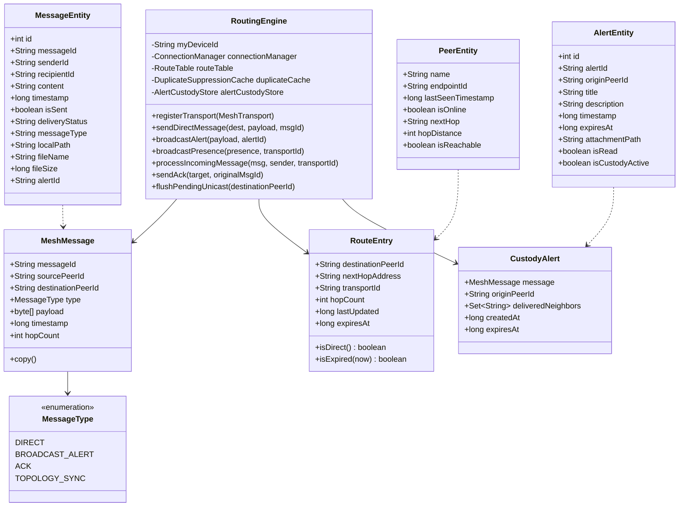
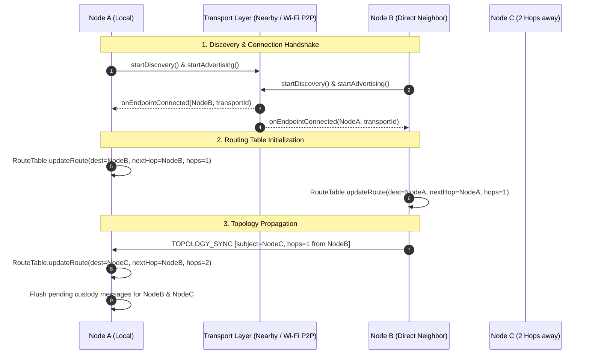
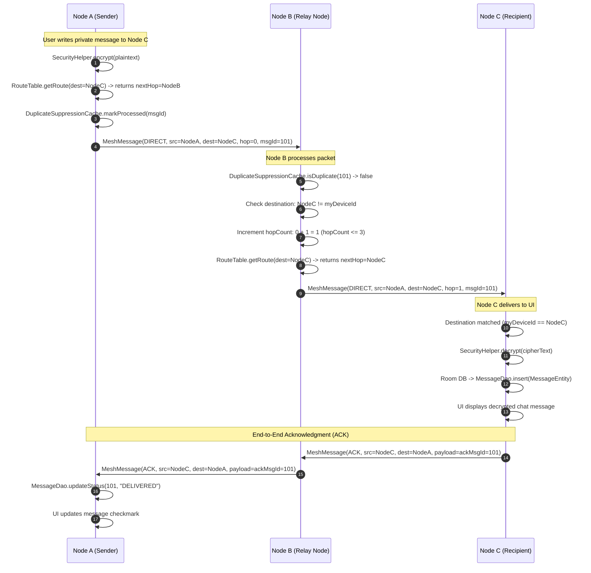
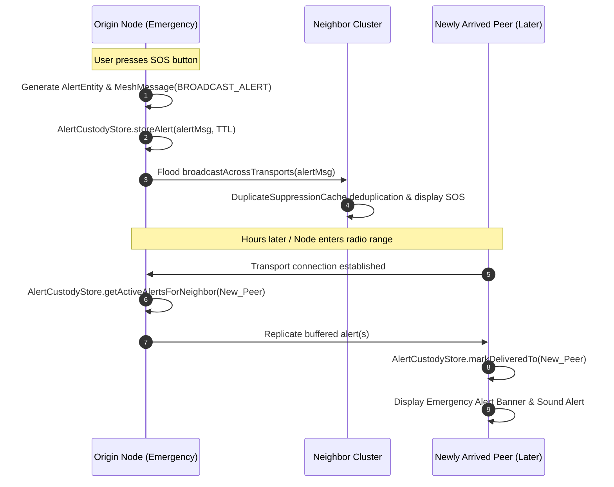
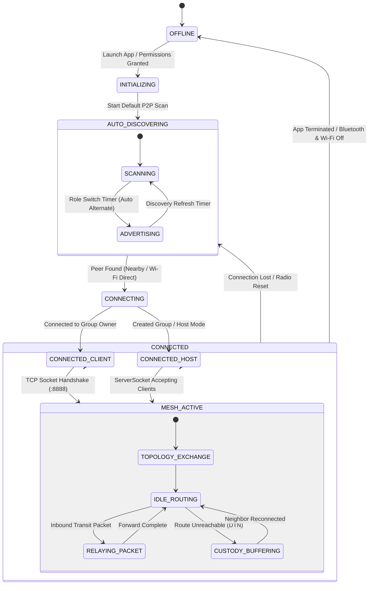

# NEXORA (PeerConnect) — Technical Architecture & Workflow Specification

> **Package:** `com.fury.peerconnect`  
> **Application Label:** `NEXORA`  
> **Target Platform:** Android (Target SDK: 36, Min SDK: 24)  
> **Network Mode:** Decentralized Off-Grid Multi-Hop Mesh Network

---

## 📖 Documentation Hub

Comprehensive engineering guides and technical specifications are organized in the [`docs/`](docs/) directory:

| Specification | Path | Description |
|---|---|---|
| 🌐 **Mesh Protocol** | [`docs/mesh.md`](docs/mesh.md) | Multi-hop routing, hop limits, packet structure, TTL, and hybrid transports. |
| 🏛️ **System Architecture** | [`docs/arch.md`](docs/arch.md) | C4 architecture diagrams, Room schemas, AES-256 encryption, and layers. |
| 🛠️ **Engineering Workflow** | [`docs/workflow.md`](docs/workflow.md) | Gradle commands, APK generation, keystore signing, and ADB logcat telemetry. |
| 🤝 **Contribution Guide** | [`docs/contribute.md`](docs/contribute.md) | Development setup, coding guidelines, branch strategy, and PR submission. |
| 🔌 **Wire Compatibility** | [`docs/wire_compat.md`](docs/wire_compat.md) | Low-level payload wire framing and serialization specifications. |

---

## 1. Executive Summary

**NEXORA** is a decentralized, off-grid peer-to-peer (P2P) mesh communication and emergency response Android application. It functions entirely without cellular network connectivity, Wi-Fi routers, or central cloud infrastructure.

Using a **Hybrid Dual-Transport Engine** combining **Google Nearby Connections (P2P Cluster)** and **Native Wi-Fi Direct (Wi-Fi P2P) with TCP socket multiplexing**, NEXORA forms self-healing ad-hoc mesh clusters. Devices discover each other locally, synchronize routing tables via multi-hop topology broadcasts, relay messages across intermediary nodes (up to a 3-hop ceiling), and utilize Delay-Tolerant Networking (DTN) store-and-forward custody for offline delivery.

---

## 2. Technology Stack & Core Components

| Layer | Technologies & Libraries | Key Components |
|---|---|---|
| **UI & Presentation** | Material Design 3, AndroidX, ViewBinding | `MainActivity`, `PeerAdapter`, `ChatAdapter`, `AlertAdapter`, `RecentActivityAdapter`, `ConnectedPeerAdapter` |
| **P2P Transport** | Google Nearby Connections API (`P2P_CLUSTER`), Android Wi-Fi Direct (`WifiP2pManager`) | `NearbyMeshTransport`, `WifiP2pMeshTransport`, `WifiP2pMeshManager`, `TcpTransportManager` (Port `8888`) |
| **Mesh Routing & DTN** | Ad-hoc multi-hop routing engine, Custody store | `RoutingEngine`, `RouteTable`, `RouteEntry`, `DuplicateSuppressionCache`, `AlertCustodyStore` |
| **Security & Encryption** | Java Cryptography Extension (JCE), AES-256 | `SecurityHelper` (`AES/CBC/PKCS5Padding`, 256-bit symmetric key) |
| **Local Persistence** | AndroidX Room ORM, SQLite, SharedPreferences | `AppDatabase`, `PeerDao`, `MessageDao`, `AlertDao`, `UserManager` (`PeerConnectPrefs`) |
| **File & Attachment I/O**| Android Storage Access Framework (SAF), AndroidX FileProvider | `FileStorageManager`, `androidx.core.content.FileProvider` (`com.fury.peerconnect.fileprovider`) |
| **Asynchronous Engine** | Kotlin Coroutines, Java Concurrency (`ExecutorService`, `ConcurrentHashMap`, `AtomicBoolean`) | `Dispatchers.IO`, `LifecycleCoroutineScope` |

---

## 3. High-Level System Architecture

```mermaid
flowchart TB
    subgraph UI_Layer ["Presentation Layer (UI)"]
        MA["MainActivity"]
        DASH["Dashboard Tab\n(Node Metrics, Recent Activity)"]
        PEERS["Peers / Messages Tab\n(Peer List, Pairing Mode)"]
        ALERTS["Alerts Tab\n(SOS, Broadcast Feed, Filter Chips)"]
        CHAT["Direct Chat / Thread View\n(1-on-1 Chat, File Attachments)"]
        MA --> DASH
        MA --> PEERS
        MA --> ALERTS
        MA --> CHAT
    end

    subgraph Logic_Layer ["Application Logic & Security"]
        UM["UserManager\n(Node Identity & Nickname)"]
        SEC["SecurityHelper\n(AES-256 Encryption / Decryption)"]
        FSM["FileStorageManager\n(Payload Serialization & File I/O)"]
    end

    subgraph Routing_Layer ["Mesh Routing & DTN Engine"]
        RE["RoutingEngine\n(Packet Router & Dispatcher)"]
        RT["RouteTable\n(Next-Hop Cache & TTL Tracker)"]
        DSC["DuplicateSuppressionCache\n(Seen Message Deduplication)"]
        ACS["AlertCustodyStore\n(Delay-Tolerant Store-and-Forward)"]
        RE --> RT
        RE --> DSC
        RE --> ACS
    end

    subgraph Transport_Layer ["Hybrid Transport Abstraction"]
        CM["ConnectionManager\n(Active Socket & Session Registry)"]
        MT["<<Interface>> MeshTransport"]
        NMT["NearbyMeshTransport\n(Google Nearby P2P_CLUSTER)"]
        WMT["WifiP2pMeshTransport\n(Wi-Fi Direct Wrapper)"]
        TCP["TcpTransportManager\n(ServerSocket :8888 / TCP Sockets)"]
        WPM["WifiP2pMeshManager\n(Group Owner & Client Manager)"]
        
        MT <|.. NMT
        MT <|.. WMT
        WMT --> CM
        WMT --> TCP
        WMT --> WPM
    end

    subgraph Data_Layer ["Local Storage & Offline Database"]
        DB[("Room Database\nAppDatabase")]
        P_DAO["PeerDao\n(PeerEntity)"]
        M_DAO["MessageDao\n(MessageEntity)"]
        A_DAO["AlertDao\n(AlertEntity)"]
        DB --> P_DAO
        DB --> M_DAO
        DB --> A_DAO
    end

    MA --> RE
    MA --> UM
    MA --> SEC
    MA --> FSM
    MA --> DB
    RE --> MT
    RE --> CM
```

---

## 4. Detailed Data & Class Model



---

## 5. Core Workflows & Protocols

### 5.1. Dual-Transport Peer Discovery & Topology Synchronization

NEXORA operates an automated local mesh handshake:

1. **Nearby Transport**: Discovers endpoints using the Service ID `com.fury.peerconnect_v2` under `P2P_CLUSTER` topology.
2. **Wi-Fi Direct Transport**: Establishes autonomous Group Owners (GO) and negotiates client connections. Group Owners start a multi-client `ServerSocket` on TCP port `8888`.
3. **Topology Broadcast**: Once connected, nodes exchange `TOPOLOGY_SYNC` messages containing `PresencePayload` (device ID, status, reachable neighbors, hop distance).



---

### 5.2. Multi-Hop Direct Messaging & End-to-End Acknowledgment

When Node A sends a private message to Node C (out of direct radio range, via Node B):

1. **Encryption**: `SecurityHelper` encrypts message payload using AES-256 (`AES/CBC/PKCS5Padding`).
2. **Route Resolution**: `RoutingEngine` queries `RouteTable` for `destinationPeerId = NodeC` $\rightarrow$ resolves `nextHop = NodeB`.
3. **Hop Control**: Message is wrapped into `MeshMessage(hopCount=0)`. Intermediary nodes drop packets if `hopCount > 3`.
4. **Deduplication**: `DuplicateSuppressionCache` inspects `messageId` at every hop.
5. **End-to-End ACK**: Destination Node C generates an `ACK` message addressed to Node A, routed back through the mesh.



---

### 5.3. Emergency SOS Broadcast & DTN Store-and-Forward (Custody)

In disaster or network partition scenarios where routes are absent:

1. **Controlled Flooding**: Emergency SOS alerts (`BROADCAST_ALERT`) are broadcast across all active transports (`Nearby` + `Wi-Fi Direct`).
2. **Custody Storage**: The alert is stored locally in `AlertCustodyStore` with a validity Time-To-Live (TTL).
3. **Opportunistic Forwarding**: When an isolated device comes into contact with another peer later, `flushPendingUnicast()` and `getActiveAlertsForNeighbor()` immediately replicate the emergency alert to the newly discovered peer.



---

## 6. Node Lifecycle & Radio State Machine



---

## 7. Security Architecture & Observations

- **Encryption Standard**: AES-256 symmetric cipher in CBC mode with PKCS5 padding (`AES/CBC/PKCS5Padding`).
- **Cryptographic Keying**: Embedded static 256-bit pre-shared key (`12345678901234567890123456789012`) with a zero-byte 16-byte initialization vector (IV).
- **Authorization Callback**: `RoutingEngine` includes an `isPeerAuthorized` predicate hook prior to routing application-level payloads.
- **Loop Avoidance**: Deduplication filter prevents infinite packet circulation in dense mesh loops.
- **Hop Ceiling**: Hard ceiling limit of 3 hops protects battery life and wireless channel capacity during broadcast flooding.
