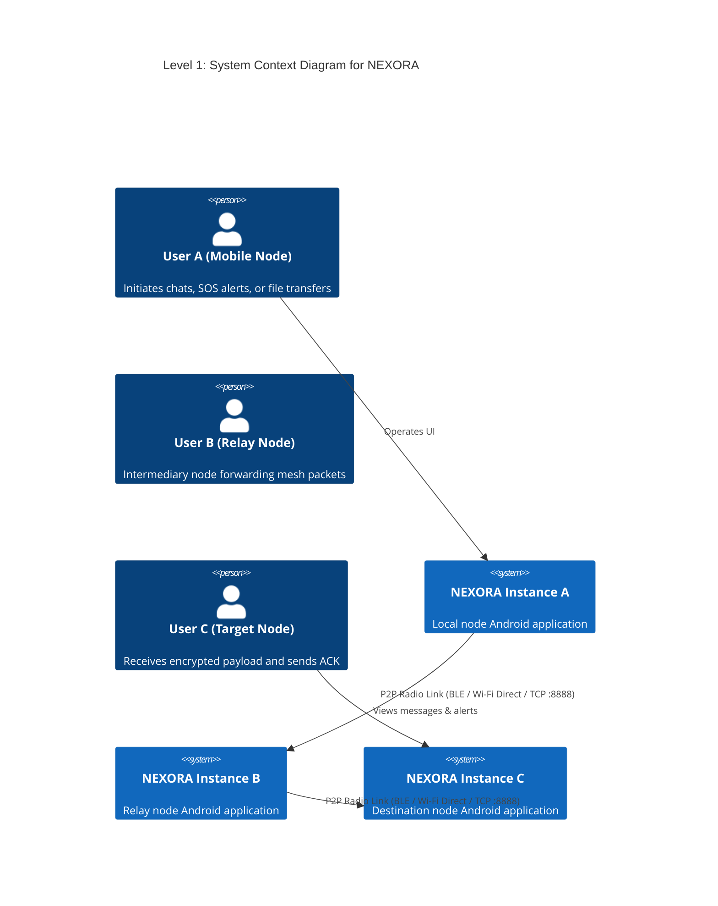
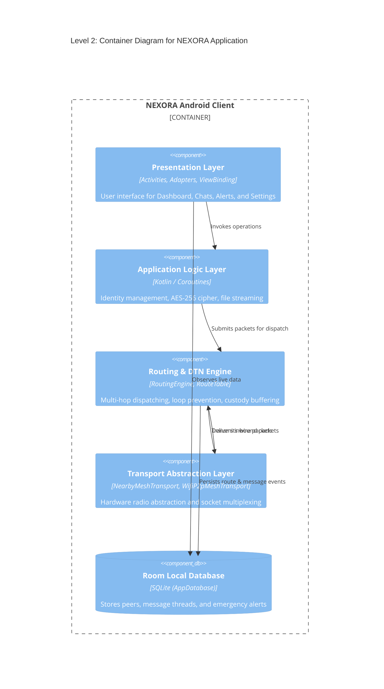
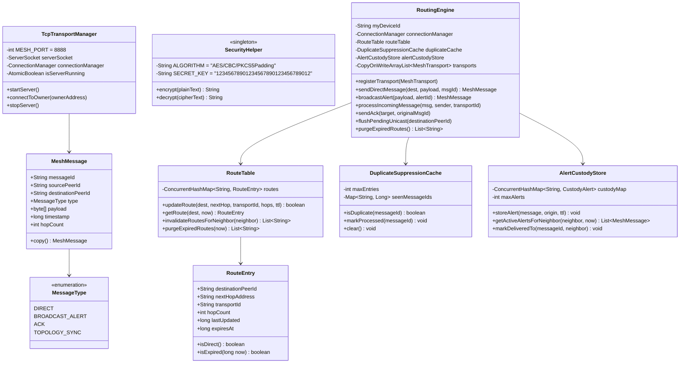
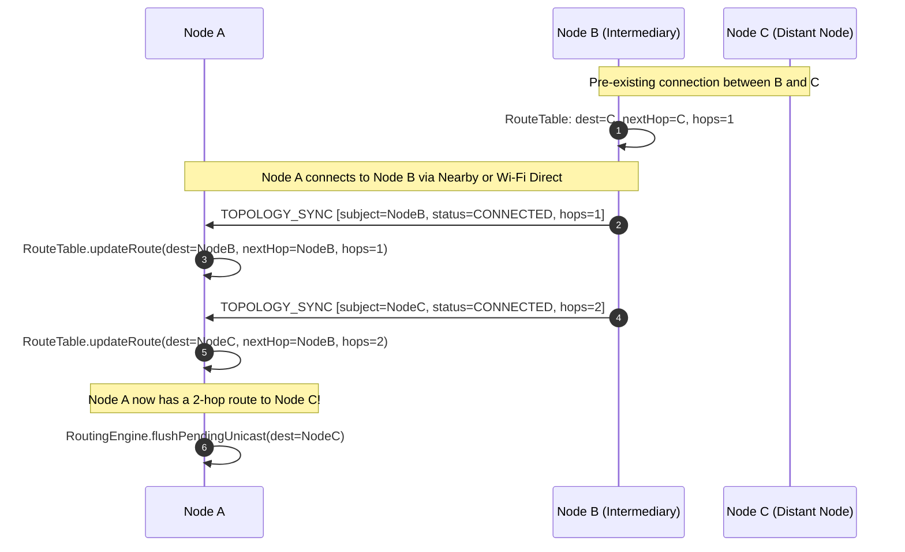
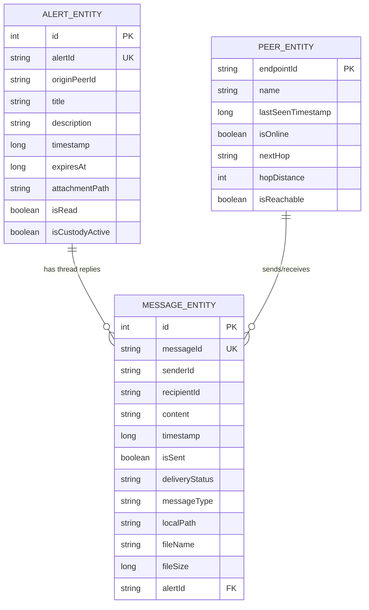

# NEXORA — Architecture & Technical Design Document

> **Document Type:** Software Architecture Document (SAD)  
> **Target System:** NEXORA Android Application  
> **Package Identifier:** `com.fury.peerconnect`  
> **Target SDK:** 36 (Android 16) | **Min SDK:** 24 (Android 7.0)  
> **Network Protocol:** Ad-Hoc Multi-Hop Peer-to-Peer Mesh with Delay-Tolerant Networking (DTN)  

---

## 1. Architectural Goals & System Constraints

The core architectural requirement of NEXORA is **infrastructure-free, zero-trust, resilient peer communication**:

1. **Zero External Dependencies:** Operates without cell towers, internet gateways, satellite links, DNS, or central servers.
2. **Dual-Radio Multiplexing:** Simultaneously leverages **Google Nearby Connections (BLE + Wi-Fi Hotspot)** and native **Android Wi-Fi Direct (P2P + TCP Sockets)**.
3. **Multi-Hop Relay:** Allows peers out of direct physical radio range to communicate through intermediary nodes up to a hard ceiling limit ($H_{\text{max}} = 3$).
4. **Delay-Tolerant Networking (DTN):** Employs store-and-forward custody transfer (`AlertCustodyStore`) to buffer packets during network partitions and replicate them when contact resumes.
5. **Symmetric Payload Confidentiality:** Protects unicast messages and alerts with 256-bit AES encryption.

---

## 2. C4 Architecture Views

### 2.1. C4 Context Diagram (Level 1)



---

### 2.2. C4 Container Diagram (Level 2)



---

### 2.3. C4 Component Diagram: Routing & Transport (Level 3)

```mermaid
flowchart TB
    subgraph CoreEngine ["Routing & Forwarding Subsystem"]
        RE["RoutingEngine\n(Packet Router & Policy Arbiter)"]
        RT["RouteTable\n(Next-Hop Distance-Vector Cache)"]
        DSC["DuplicateSuppressionCache\n(Sliding Window Deduplication)"]
        ACS["AlertCustodyStore\n(Store-and-Forward Buffer)"]
        
        RE <--> RT
        RE <--> DSC
        RE <--> ACS
    end

    subgraph TransportSubsystem ["Dual-Transport Abstraction Subsystem"]
        MT["<<Interface>>\nMeshTransport"]
        NMT["NearbyMeshTransport\n(Google Nearby Connections API)"]
        WMT["WifiP2pMeshTransport\n(Android Wi-Fi P2P Framework)"]
        CM["ConnectionManager\n(Active Socket Registry)"]
        TTM["TcpTransportManager\n(Port 8888 TCP Engine)"]
        WPM["WifiP2pMeshManager\n(Group Owner & Client Handler)"]
        PC["PeerConnection\n(ObjectInputStream/OutputStream)"]

        MT <|.. NMT
        MT <|.. WMT
        WMT --> CM
        WMT --> TTM
        WMT --> WPM
        TTM --> CM
        CM --> PC
    end

    RE <--> MT
```

---

## 3. Layered Architectural Decomposition

```
+-------------------------------------------------------------------------+
|                        1. PRESENTATION LAYER                            |
|  - MainActivity: Navigation controller, bottom sheet, intent coordinator|
|  - Adapters: PeerAdapter, ChatAdapter, AlertAdapter, ConnectedPeerAdapter|
|  - Screens: Dashboard, Messages/Peers, Alerts, Settings, Chat, Thread   |
+-------------------------------------------------------------------------+
                                    |
                                    v
+-------------------------------------------------------------------------+
|                     2. APPLICATION LOGIC & UTILITIES                    |
|  - UserManager: Peer identity, nickname, shared preferences             |
|  - SecurityHelper: AES-256/CBC/PKCS5Padding encryption/decryption engine|
|  - FileStorageManager: Payload byte persistence, FileProvider resolution|
+-------------------------------------------------------------------------+
                                    |
                                    v
+-------------------------------------------------------------------------+
|                  3. MESH ROUTING & DTN ENGINE                           |
|  - RoutingEngine: Packet validation, hop limit (<=3), unicast/broadcast |
|  - RouteTable & RouteEntry: Next-hop resolution, metric, TTL expiration |
|  - DuplicateSuppressionCache: Deduplication window preventing loops     |
|  - AlertCustodyStore: Bundle buffer for Delay-Tolerant Networking       |
+-------------------------------------------------------------------------+
                                    |
                                    v
+-------------------------------------------------------------------------+
|                 4. HARDWARE RADIO & TRANSPORT LAYER                     |
|  - MeshTransport Interface: Packet send, broadcast, neighbor callbacks  |
|  - NearbyMeshTransport: Google Nearby Connections (P2P_CLUSTER)         |
|  - WifiP2pMeshTransport: Native Wi-Fi Direct interface                  |
|  - TcpTransportManager: Port 8888 TCP ServerSocket & client sockets     |
|  - ConnectionManager: Concurrent map of active physical sockets         |
+-------------------------------------------------------------------------+
                                    |
                                    v
+-------------------------------------------------------------------------+
|                       5. DATA PERSISTENCE LAYER                         |
|  - Room Database: AppDatabase (SQLite)                                  |
|  - Entities: PeerEntity, MessageEntity, AlertEntity                     |
|  - DAOs: PeerDao, MessageDao, AlertDao                                  |
+-------------------------------------------------------------------------+
```

---

## 4. Detailed Class & Object Model



---

## 5. Wire Protocol & Packet Formats

### 5.1. `MeshMessage` Frame Header

All communication across both Nearby and Wi-Fi Direct transports uses the standardized `MeshMessage` frame:

| Offset / Field | Type | Description |
|---|---|---|
| `messageId` | `String` (UUID / Timestamp string) | Globally unique message identifier for tracking and deduplication. |
| `sourcePeerId` | `String` | Originating peer node identifier. |
| `destinationPeerId` | `String` | Target peer node identifier (`null` for broadcast alerts). |
| `type` | `MessageType` (Enum: 4 bytes) | `DIRECT` (0), `BROADCAST_ALERT` (1), `ACK` (2), `TOPOLOGY_SYNC` (3). |
| `hopCount` | `int` (32-bit signed int) | Number of relays traversed. Initialized to `0`, max limit `3`. |
| `timestamp` | `long` (64-bit millisecond epoch) | Unix timestamp at packet origination. |
| `payload` | `byte[]` | Encrypted payload (AES ciphertext) or serialized control object. |

---

### 5.2. `PresencePayload` Frame Header (Topology Control)

When `type == TOPOLOGY_SYNC`, `payload` deserializes to `PresencePayload`:

| Field | Type | Description |
|---|---|---|
| `subjectPeerId` | `String` | Node being advertised in the network graph. |
| `status` | `PeerStatus` (Enum) | `CONNECTED` or `DISCONNECTED`. |
| `connectionType` | `String` | Transport layer link type (`"NEARBY"`, `"WIFI_P2P"`). |
| `timestamp` | `long` | Timestamp of presence beacon generation. |

---

## 6. Detailed Algorithmic Specifications

### 6.1. Multi-Hop Packet Routing Algorithm

```
ALGORITHM ProcessIncomingPacket(message, senderNeighborAddress, incomingTransportId):
    1. IF DuplicateSuppressionCache.isDuplicate(message.messageId) THEN:
           LOG "Duplicate message suppressed: " + message.messageId
           RETURN
       END IF

    2. DuplicateSuppressionCache.markProcessed(message.messageId)

    3. IF message.hopCount > 3 THEN:
           LOG "Hop limit ceiling reached (>3). Dropping packet."
           RETURN
       END IF

    4. IF NOT isPeerAuthorized(message.sourcePeerId) THEN:
           LOG "Originator unauthorized. Dropping packet."
           RETURN
       END IF

    5. IF message.destinationPeerId == NULL OR message.destinationPeerId == myDeviceId THEN:
           // Terminal destination reached
           IF message.type == MessageType.DIRECT THEN:
               payloadText = SecurityHelper.decrypt(message.payload)
               onApplicationPayloadReceived(message.sourcePeerId, payloadText)
               sendAck(message.sourcePeerId, message.messageId)
           ELSE IF message.type == MessageType.ACK THEN:
               onAckReceived(message.sourcePeerId, message.messageId)
           ELSE IF message.type == MessageType.BROADCAST_ALERT THEN:
               payloadText = SecurityHelper.decrypt(message.payload)
               AlertCustodyStore.storeAlert(message, message.sourcePeerId)
               onApplicationPayloadReceived(message.sourcePeerId, payloadText)
           ELSE IF message.type == MessageType.TOPOLOGY_SYNC THEN:
               processTopologySync(message, senderNeighborAddress, incomingTransportId)
           END IF
           RETURN
       END IF

    6. IF message.type == MessageType.BROADCAST_ALERT THEN:
           // Deliver locally and flood to neighbors
           payloadText = SecurityHelper.decrypt(message.payload)
           AlertCustodyStore.storeAlert(message, message.sourcePeerId)
           onApplicationPayloadReceived(message.sourcePeerId, payloadText)
           
           forwardMessage = message.copy(hopCount = message.hopCount + 1)
           broadcastAcrossTransports(forwardMessage, excludeNeighbor = senderNeighborAddress)
           RETURN
       END IF

    7. IF message.type == MessageType.DIRECT THEN:
           // Multi-hop unicast forwarding
           route = RouteTable.getRoute(message.destinationPeerId)
           IF route != NULL AND NOT route.isExpired() THEN:
               forwardMessage = message.copy(hopCount = message.hopCount + 1)
               success = sendViaTransport(route.transportId, route.nextHopAddress, forwardMessage)
               IF NOT success THEN:
                   AlertCustodyStore.storePendingUnicast(forwardMessage)
               END IF
           ELSE:
               // No route available: Buffer for DTN opportunistic delivery
               AlertCustodyStore.storePendingUnicast(forwardMessage)
           END IF
       END IF
```

---

### 6.2. Route Discovery & Topology Exchange Protocol



---

## 7. Security Architecture & Threat Model

### 7.1. Cryptographic Specifications

- **Cipher Specification:** `AES/CBC/PKCS5Padding`
- **Key Derivation:** 32 UTF-8 bytes (`"12345678901234567890123456789012"` $\rightarrow$ 256-bit AES key)
- **Initialization Vector (IV):** Static 16-byte zero array (`byte[16]`)
- **Encoding:** Base64 NO_WRAP (`Base64.NO_WRAP`)

### 7.2. Threat Model & Security Observations

| Threat / Risk | Mitigating Architecture | Residual Vulnerability |
|---|---|---|
| **Eavesdropping by Intermediate Nodes** | End-to-end encrypted payload via `SecurityHelper`. Nodes relaying `MeshMessage` cannot read ciphertext without the key. | Symmetric pre-shared key is embedded in bytecode; extraction via decompilation compromises confidentiality. |
| **Denial of Service via Packet Loops** | `DuplicateSuppressionCache` and $H_{\text{max}} = 3$ hop ceiling. | High volume broadcast flood attacks could degrade battery within 3 hops. |
| **Spoofing & Impersonation** | Peer ID authorization hooks (`isPeerAuthorized`). | Packets are not digitally signed with asymmetric signatures (no RSA/ECDSA certs). |
| **Offline Message Tampering** | AES CBC padding validation throws exceptions on tampered ciphertext, caught and flagged as `[Decryption Failed]`. | Without HMAC/AEAD (e.g. AES-GCM), ciphertext is vulnerable to bit-flipping padding oracle attacks. |

---

## 8. Data Schema & Persistence Model


