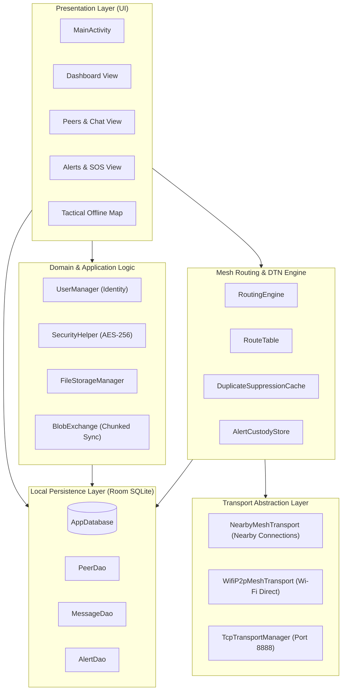
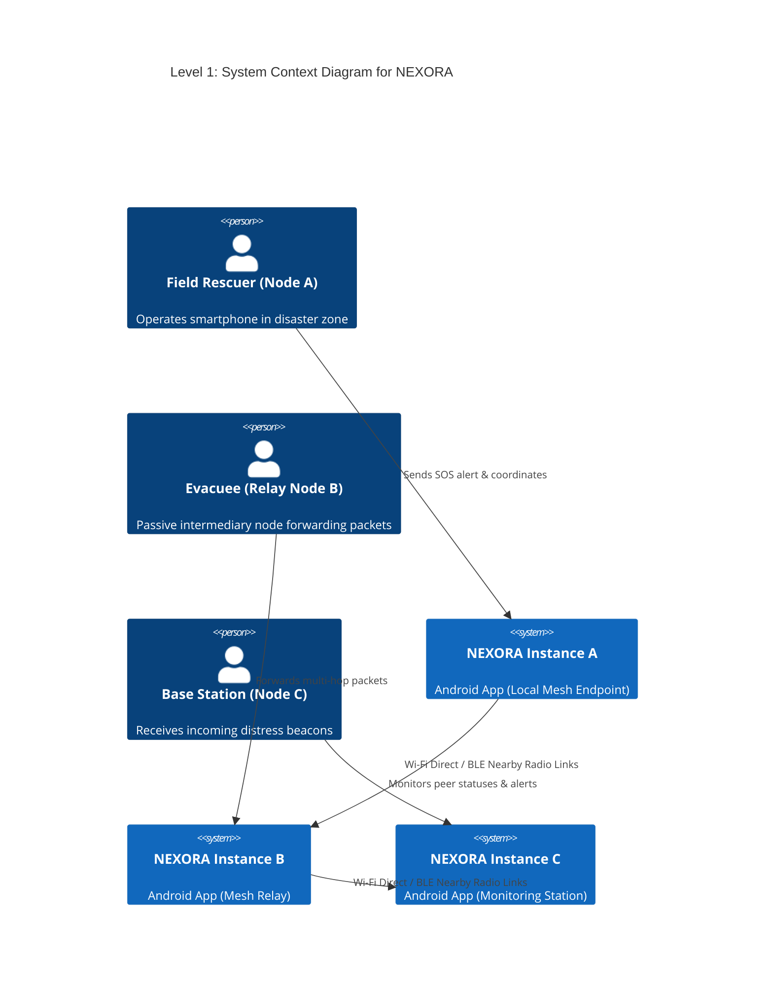
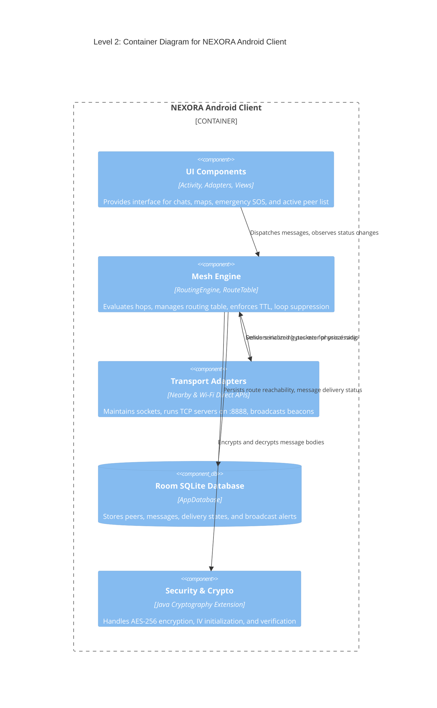
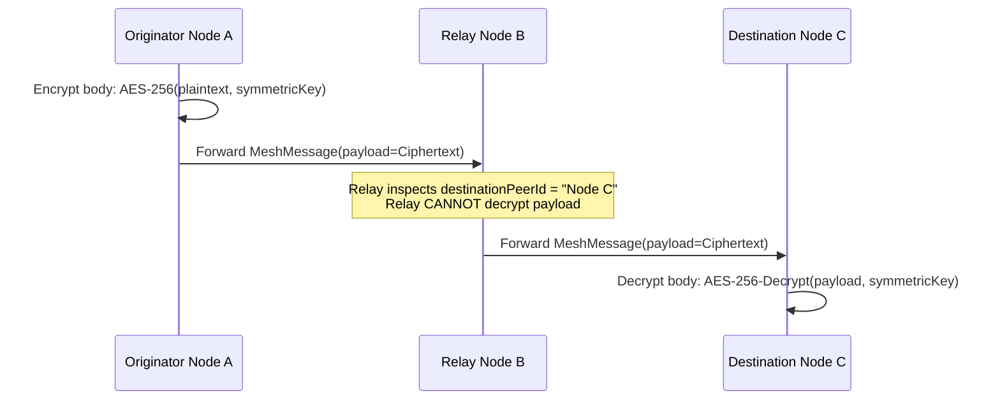

# NEXORA — System Architecture & Technical Design

> **Package Identifier:** `com.fury.peerconnect`  
> **Application Name:** NEXORA  
> **Target Platform:** Android (Min SDK: 24, Target SDK: 36 / Android 16)  
> **Architecture Pattern:** Clean Architecture + Reactive MVVM / Event-Driven Mesh  

---

## 1. Architectural Philosophy

NEXORA is engineered to be **resilient, decentralized, and zero-trust**. In emergency situations, traditional client-server assumptions (DNS, centralized authentication, cloud databases, REST APIs) completely fail. NEXORA replaces centralized cloud infrastructure with **local peer orchestration, multi-hop routing, and distributed local storage**.

---

## 2. C4 Architectural Views

### 2.1 C4 Context (Level 1)

### 2.2 C4 Container (Level 2)

---

## 3. Core Subsystems

### 3.1 Presentation Layer (`com.fury.peerconnect.ui`)
- **Single Activity Architecture:** `MainActivity` coordinates four primary interfaces:
  - **Dashboard:** Network topology summary, active connection counts, live telemetry.
  - **Peers / Chat:** Direct messaging threads, file attachment sharing, online indicators.
  - **Alerts Feed:** Broadcast channel for SOS alerts, filtering chips (All, Medical, Fire, Lost Person).
  - **Tactical Map:** Offline grid preview with live peer locations and beacon coordinates.
- **Adapters:** Highly optimized `RecyclerView` adapters (`PeerAdapter`, `ChatAdapter`, `AlertAdapter`, `ConnectedPeerAdapter`, `RecentActivityAdapter`) with differential list updates.

### 3.2 Routing & Mesh Engine (`com.fury.peerconnect.network.routing`)
- **`RoutingEngine`**: The heart of packet delivery. Dispatches unicast and broadcast payloads, manages delivery confirmations (`ACK`), evaluates hop limits, and interacts with custody stores.
- **`RouteTable` & `RouteEntry`**: Keeps active paths to indirect nodes. Contains next-hop address, hop count (1 to 3), and expiration timestamps (35s TTL).
- **`DuplicateSuppressionCache`**: In-memory bounded cache preventing packet multiplication loops.
- **`AlertCustodyStore`**: Manages delay-tolerant DTN storage for offline delivery replication.

### 3.3 Transport Abstraction Layer (`com.fury.peerconnect.network.transport`)
- **`NearbyMeshTransport`**: Interfaces with Google Play Services Nearby Connections (`P2P_CLUSTER`).
- **`WifiP2pMeshTransport` & `WifiP2pMeshManager`**: Operates Android's native Wi-Fi P2P framework, creating autonomous groups and managing IP/port socket connections.
- **`TcpTransportManager`**: High-performance socket server listening on port `8888`. Handles raw binary stream framing for multi-megabyte file transfers.

### 3.4 Data Persistence Layer (`com.fury.peerconnect.data`)
- **Room ORM Database (`AppDatabase`)**:
  - `PeerEntity`: Tracks known peer usernames, direct endpoint IDs, reachability status, and hop distance.
  - `MessageEntity`: Local message history, sender/receiver IDs, timestamps, delivery state (`PENDING`, `SENT`, `DELIVERED`), and local file URIs.
  - `AlertEntity`: Emergency broadcast records, originators, coordinates, urgency severity, and read flags.

---

## 4. Cryptographic Security Model

NEXORA enforces zero-knowledge privacy for intermediate relay nodes:

1. **Payload Secrecy:** Only the source and final recipient possess the capability to decrypt chat contents and sensitive alert coordinates.
2. **Intermediate Node Privacy:** Intermediate hops read only metadata necessary for forwarding: `messageId`, `destinationPeerId`, and `hopCount`.

---

## 5. Threading & Concurrency Model

- **Background Dispatchers:** All network I/O, socket reads, Room database transactions, and cryptographic operations run exclusively on `Dispatchers.IO` using Kotlin Coroutines.
- **UI Thread Isolation:** UI rendering is scheduled using `withContext(Dispatchers.Main)` or `lifecycleScope.launch`.
- **Thread Safety:** In-memory tables (`NeighborTable`, `RouteTable`, `DuplicateSuppressionCache`) utilize `ConcurrentHashMap`, `CopyOnWriteArrayList`, and `AtomicBoolean` to ensure lock-free, race-condition-free concurrency.
