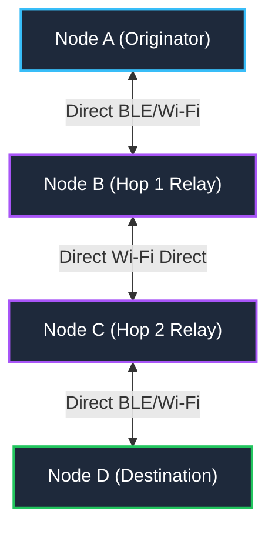
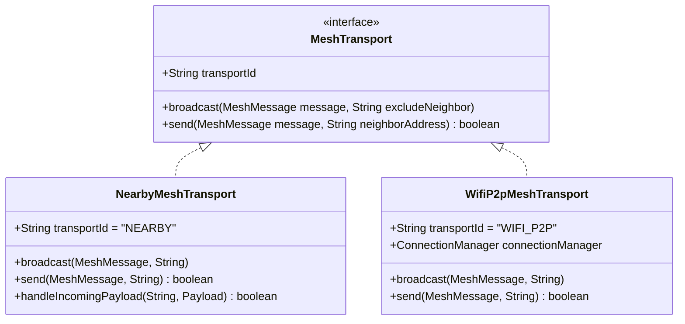
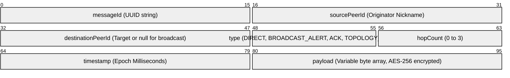
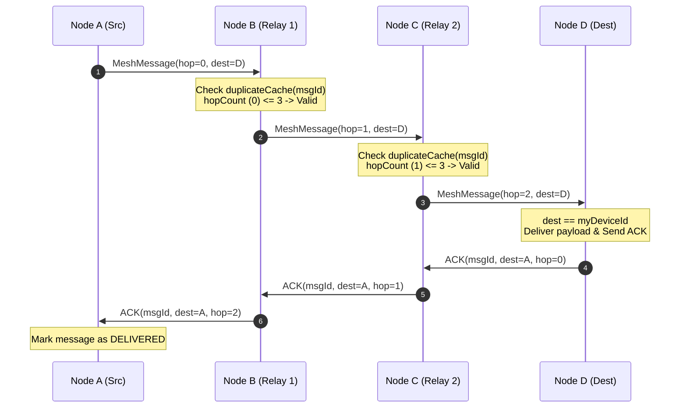
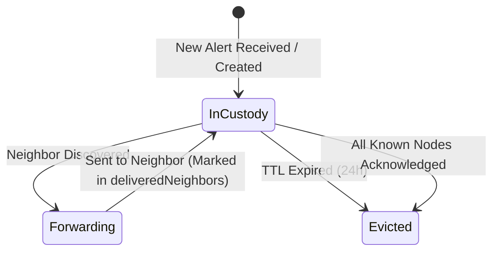

# NEXORA — Mesh Networking Protocol & Routing Specification

> **Package:** `com.fury.peerconnect.network`  
> **Network Model:** Decentralized Ad-Hoc Multi-Hop Peer-to-Peer (P2P) Mesh  
> **Transports:** Google Nearby Connections (`P2P_CLUSTER`) + Wi-Fi Direct (TCP `:8888`)  
> **Hop Limit:** $H_{\text{max}} = 3$  
> **Route Expiration (TTL):** 35 Seconds  

---

## 1. Overview & Principles

NEXORA operates in **completely off-grid, infrastructure-free environments** (natural disasters, search and rescue, remote expeditions, cellular blackouts). Nodes communicate directly device-to-device using low-latency radio interfaces without requiring internet gateways, Wi-Fi routers, DNS, or central servers.



### Key Principles
1. **Hybrid Dual-Transport:** Uses Google Nearby Connections (`P2P_CLUSTER`) for high-density ad-hoc discovery and Wi-Fi Direct with raw TCP sockets (`:8888`) for high-throughput binary streaming.
2. **Multi-Hop Relay:** Out-of-range nodes exchange unicast packets and broadcast alerts through intermediate nodes up to a maximum distance of 3 hops ($H \le 3$).
3. **Reactive Topology Discovery:** Routing paths are dynamically updated using lightweight presence announcements (`TOPOLOGY_SYNC`) propagated across active links.
4. **Delay-Tolerant Networking (DTN):** Store-and-forward custody allows alerts to be preserved and replicated when intermittent network partitions reconnect.
5. **Loop Prevention:** 64-bit cryptographic message hashes and UUIDs are tracked in bounded duplicate suppression caches to discard re-broadcasts.

---

## 2. Hybrid Transport Architecture

NEXORA abstracts physical wireless radios through the `MeshTransport` interface:



### 2.1 Google Nearby Connections (`P2P_CLUSTER`)
- **Strategy:** `Strategy.P2P_CLUSTER` — Enables M-to-N mesh topologies where any node can advertise and discover simultaneously.
- **Service ID:** `com.fury.peerconnect`
- **Role Alternation:** When not in explicit pairing mode, nodes alternate between Advertising (host beacon) and Discovery (scanner) to break symmetry and connect automatically.
- **Payload Types:**
  - `Payload.Type.BYTES`: Used for control messages, routing updates, encrypted chats, and alert metadata.
  - `Payload.Type.FILE`: Used for offline image and document transfers.

### 2.2 Native Wi-Fi Direct & TCP Multiplexing
- **Manager:** `WifiP2pMeshManager` (interfacing with `android.net.wifi.p2p.WifiP2pManager`).
- **Port:** `8888` for peer-to-peer TCP streaming.
- **Group Owner (GO) Negotiation:** Automatically creates Wi-Fi Direct groups; clients obtain IP configuration from the Group Owner and establish TCP socket connections to `TcpTransportManager`.

---

## 3. Packet Format & Serialization

All mesh messages are encapsulated within `MeshMessage` structures and serialized via binary object streams:



### Message Types (`MessageType`)
| Type | Value | Scope | Description |
|---|---|---|---|
| `DIRECT` | Unicast | Target Node | One-to-one encrypted private chat, file chunk, or ping |
| `BROADCAST_ALERT` | Broadcast | All Nodes | Emergency SOS broadcast, disaster alert, or tactical message |
| `ACK` | Unicast | Originator | End-to-end delivery receipt confirmation |
| `TOPOLOGY_SYNC` | Broadcast | Neighbors | Presence announcement containing online/offline neighbor status |

---

## 4. Routing Engine & Route Table

### 4.1 Routing Table Structure (`RouteTable`)
Every node maintains an in-memory `RouteTable` mapping destination peer IDs to next-hop physical addresses:

```kotlin
data class RouteEntry(
    val destinationPeerId: String,
    val nextHopAddress: String,
    val transportId: String,
    val hopCount: Int,
    val lastUpdated: Long,
    val expiresAt: Long
)
```

### 4.2 Route Selection & TTL Rules
1. **Shortest Hop Preference:** If a route is received with a smaller `hopCount` than the stored entry, it immediately supersedes the existing route.
2. **Freshness Renewal:** If a route is received with the same hop count and same next-hop, its `expiresAt` timestamp is refreshed to `now + DEFAULT_TTL_MS` (35 seconds).
3. **Route Invalidation:** When a direct neighbor disconnects, `invalidateRoutesForNeighbor(neighborAddress)` purges all routes dependent on that neighbor.
4. **Stale Route Eviction:** The periodic watchdog calls `purgeExpiredRoutes()` to evict routes older than 35s and alerts the UI to set affected peers to offline.

---

## 5. Multi-Hop Forwarding & Loop Suppression



### Forwarding Constraints
1. **Hop Ceiling ($H_{\text{max}} = 3$):** If `message.hopCount > 3`, the packet is dropped immediately to prevent runaway amplification.
2. **Duplicate Cache:** Every processed or forwarded `messageId` is stored in a 1,000-entry LRU cache (`DuplicateSuppressionCache`). Packets matching an existing ID are discarded.
3. **Split Horizon:** When broadcasting, packets are excluded from the transport link or physical address from which they were received (`excludeAddress`).

---

## 6. Delay-Tolerant Networking (DTN) Store-and-Forward

For critical alerts (`BROADCAST_ALERT`), nodes must not drop packets just because downstream peers are temporarily out of radio range.



1. **Custody Storage:** Incoming alerts are persisted in `AlertCustodyStore`.
2. **Replication on Connection:** Whenever a new neighbor connects (`handleNeighborConnected`), all unexpired alerts not yet delivered to this neighbor are re-transmitted.
3. **Delivery Tracking:** The node records neighbor IDs in `deliveredNeighbors` to prevent redundant transmissions over the same link.

---

## 7. Security & Encryption

NEXORA implements symmetric authenticated encryption for user communications:

```kotlin
// SecurityHelper encryption format
// Plaintext -> AES/CBC/PKCS5Padding -> Base64 encoded payload
SecurityHelper.encrypt(plaintext: String): String
SecurityHelper.decrypt(ciphertext: String): String
```

- **Algorithm:** AES-256 in CBC mode with PKCS#5 padding.
- **Key Derivation:** Deterministic 256-bit symmetric key configured for the mesh deployment domain.
- **Tamper Evidence:** Malformed payloads fail decryption gracefully and are discarded without crashing the background routing threads.
