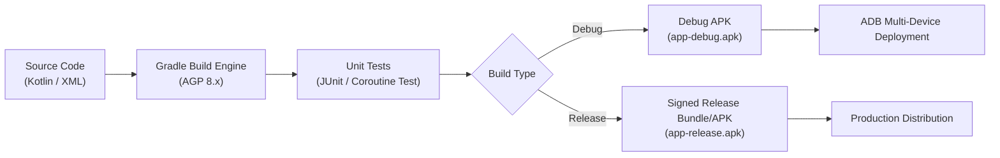
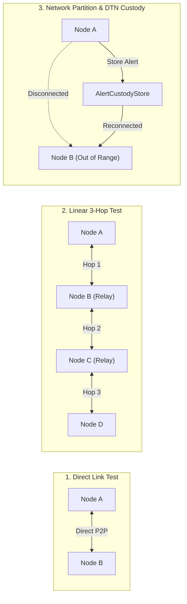

# NEXORA — Engineering & Build Workflow Guide

> **Target Platform:** Android SDK 24 to 36  
> **Build System:** Gradle (Kotlin DSL)  
> **Primary Language:** Kotlin 1.9+  

---

## 1. Development & Build Lifecycle



---

## 2. Common Gradle Commands

Execute all commands from the repository root directory using the Gradle wrapper:

### 2.1 Building Artifacts
```bash
# Clean previous build artifacts
./gradlew clean

# Build debug APK
./gradlew assembleDebug

# Build release APK (requires keystore configuration)
./gradlew assembleRelease

# Build release Android App Bundle (AAB) for Google Play
./gradlew bundleRelease
```

*Note on Windows PowerShell, use `.\gradlew.bat <task>`.*

### 2.2 Testing
```bash
# Run all unit tests
./gradlew test

# Run unit tests with stacktrace
./gradlew test --stacktrace

# Run Android Lint analysis
./gradlew lint
```

### 2.3 Installing Directly to Connected Devices
```bash
# Install debug build on all connected ADB devices
./gradlew installDebug

# Or using adb directly:
adb install -r app/build/outputs/apk/debug/app-debug.apk
```

---

## 3. Signing & Keystore Configuration

### 3.1 Debug Signing
Android Studio and Gradle automatically sign debug builds using the standard Android debug keystore located at `~/.android/debug.keystore`.

### 3.2 Release Signing
For production and field distribution, configure `release.keystore` via environment variables or `gradle.properties`:

```properties
# ~/.gradle/gradle.properties or environment variables
NEXORA_KEYSTORE_FILE=path/to/release.keystore
NEXORA_KEYSTORE_PASSWORD=your_keystore_password
NEXORA_KEY_ALIAS=nexora_key
NEXORA_KEY_PASSWORD=your_key_password
```

> [!CAUTION]
> Never commit raw keystore passwords, private keystore files, or sensitive credentials to public source repositories. Always keep them in gitignored local files or CI secret managers.

---

## 4. Multi-Device Mesh Debugging Workflow

Testing mesh routing requires multiple concurrent nodes. Follow this step-by-step procedure:

### 4.1 ADB Multi-Device Setup
Connect multiple Android devices via USB or wireless ADB:
```bash
adb devices -l
```

Deploy the application to each specific device using its serial number:
```bash
# Install on Device 1
adb -s <SERIAL_1> install -r app/build/outputs/apk/debug/app-debug.apk

# Install on Device 2
adb -s <SERIAL_2> install -r app/build/outputs/apk/debug/app-debug.apk
```

### 4.2 Logcat Monitoring & Filter Tags
Monitor real-time mesh telemetry by filtering specific Logcat tags:

```bash
# Filter all NEXORA network and routing events
adb -s <SERIAL_1> logcat -s "RoutingEngine:D" "NearbyMeshTransport:D" "WifiP2pMeshTransport:D" "MainActivity:D"
```

#### Key Logcat Tags:
| Tag | Purpose |
|---|---|
| `RoutingEngine` | Displays packet forwarding, route table updates, ACK receipts, and loop suppression |
| `NearbyMeshTransport` | Shows Google Nearby Connections endpoint discovery, payload transfers, and drops |
| `WifiP2pMeshTransport` | Shows Wi-Fi Direct Group Owner status, client connections, and TCP `:8888` streams |
| `MainActivity` | UI tab switching, permission requests, database updates, and dialog events |

---

## 5. Mesh Topology Verification Matrix

To ensure stability across all mesh scenarios, run the following verification matrix:



1. **Direct Point-to-Point:** Two devices pair within 5 meters. Verify bi-directional text chats and instant delivery acknowledgments (`ACK`).
2. **Multi-Hop Relay:** Position Node A and Node C out of radio range, with Node B midway between them. Send a message from A to C. Verify Node B logs forwarding event and Node C successfully displays the message.
3. **Partition Recovery (DTN):** Broadcast an emergency SOS alert on Node A while disconnected. Move Node A into radio range of Node B. Verify Node A's `AlertCustodyStore` automatically syncs the alert to Node B upon link establishment.
4. **Link Drop & TTL Eviction:** Turn off Bluetooth/Wi-Fi on Node B. Within 35 seconds, verify Node A detects route expiration and updates Node B's status from `Reachable` to `Offline`.

---

## 6. Continuous Integration (CI) Workflow

When pushing to GitHub, pull requests trigger automated checks via GitHub Actions:
1. **Lint & Code Format:** Validates Kotlin coding conventions.
2. **Unit Test Suite:** Executes `gradlew test` across test classes (`AlertAttachmentPipelineTest`, etc.).
3. **Build Verification:** Compiles `assembleDebug` to ensure no compile-time errors or missing symbols.
